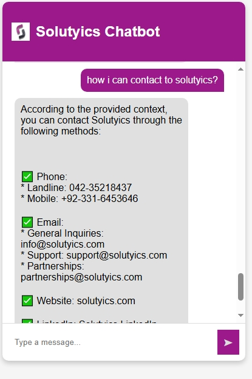

Here's a **README.md** file for your project:  

---

# **Solutyics AI Chatbot** 🤖  

Solutyics AI Chatbot is a **Retrieval-Augmented Generation (RAG) based chatbot** designed to answer queries related to Solutyics. It leverages **FAISS for vector search**, **HuggingFace Embeddings**, and **Groq LLaMA3-70B-8192** for generating intelligent responses.  

## **📌 Features**  
✔️ **Web-based chatbot** (Flask application)  
✔️ **Terminal-based chatbot** (CLI interaction)  
✔️ **Retrieves relevant context** using FAISS  
✔️ **Uses LLaMA3-70B model** for AI-driven responses  
✔️ **Handles job & internship queries smartly**  

---


## **🚀 Company Chatbot**

 
*Image showing the web-based chatbot interface.*


*Image showing the web-based chatbot interface.*

---

## **🚀 Installation & Setup**  

### **1️⃣ Clone the Repository**  
```bash
git clone https://github.com/sohail945/company-ai-chatbot.git
```

### **2️⃣ Install Dependencies**  
First, install the required Python packages using:  
```bash
pip install -r requirements.txt
```

### **3️⃣ Set Up Environment Variables**  
Create a `.env` file in the project directory and add your **Groq API key**:  
```env
GROQ_API_KEY=your_groq_api_key_here
```

---

## **💻 Running the Chatbot**  

### **Web-Based Chatbot (Flask App)**  
To run the chatbot on a web interface, execute:  
```bash
python app.py
```
Then, open **http://127.0.0.1:5000/** in your browser to chat with the bot.

---

### **Terminal-Based Chatbot (CLI Mode)**  
If you want to interact with the chatbot in the terminal, run:  
```bash
python chatbot.py
```
The chatbot will start, and you can ask questions directly in the terminal.

---

## **🛠️ Project Structure**  
```
📂 solutyics-chatbot
 ├── app.py           # Flask-based web chatbot
 ├── chatbot.py       # Terminal-based chatbot
 ├── templates/
 │   ├── index.html   # Frontend UI for chatbot
 ├── static/
 │   ├── style.css    # Styling for web chatbot
 │   ├── script.js    # JavaScript for interactivity
 ├── embeddings/
 │   ├── faiss_index  # FAISS vector database
 ├── .env             # API keys & environment variables
 ├── requirements.txt # Python dependencies
 ├── README.md        # Project documentation
```

---

## **🛠️ Technologies Used**  
🔹 **Flask** - For web-based chatbot  
🔹 **FAISS** - Fast nearest neighbor search  
🔹 **LangChain** - For retrieval-augmented generation  
🔹 **HuggingFace Embeddings** - Text vectorization  
🔹 **Groq LLaMA3-70B** - Large Language Model  
🔹 **JavaScript (Frontend)** - For chat interactions  

---

## **📌 Notes**  
- Ensure you have **Python 3.8+** installed.  
- The **FAISS index** (`faiss_index`) should be in the `embeddings/` folder.  
- Make sure `.env` is properly configured before running the chatbot.  

---

## **🤝 Contributing**  
Feel free to open an issue or submit a pull request if you want to improve the chatbot.    

---

This README provides clear instructions on **setup, usage, and project details**. Let me know if you need any modifications! 🚀
